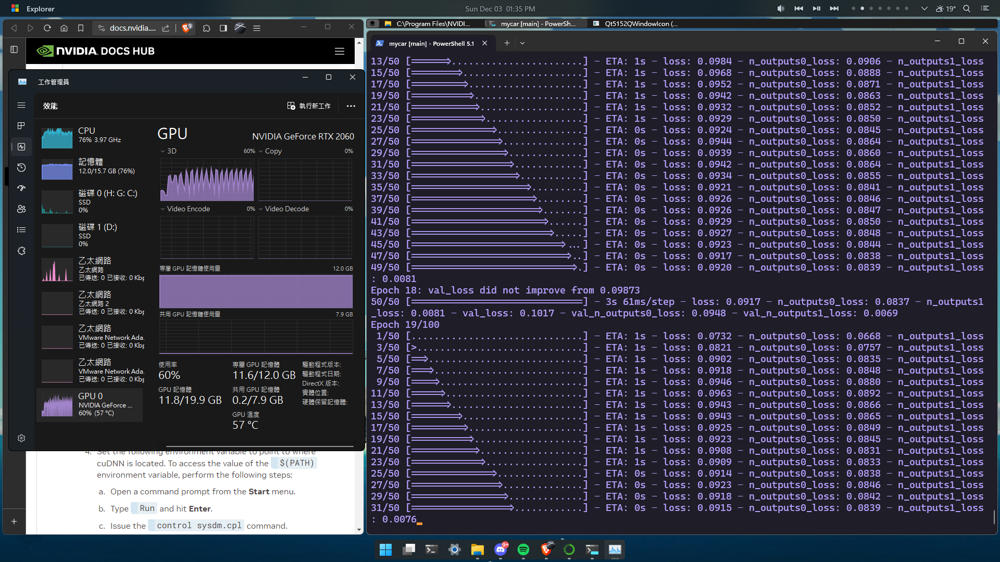

# mycar

* GPU test result:


## Training Script

* Usage:
```powershell
./train {Times}
```
    
**`Times`** is the number of how many time you trained before today, if I trained once before and I want to train again then the `Times` should be 2

* ex:  
    Today is 12/30/2023(MM/dd/YYYY), I've collect data and want to train models, the command should be like this:
    ```powershell
    ./train.ps1 1
    ```
    
    If I collect another data and want to train models again, the command will be like this:
    ```powershell
    ./train.ps1 2
    ```
